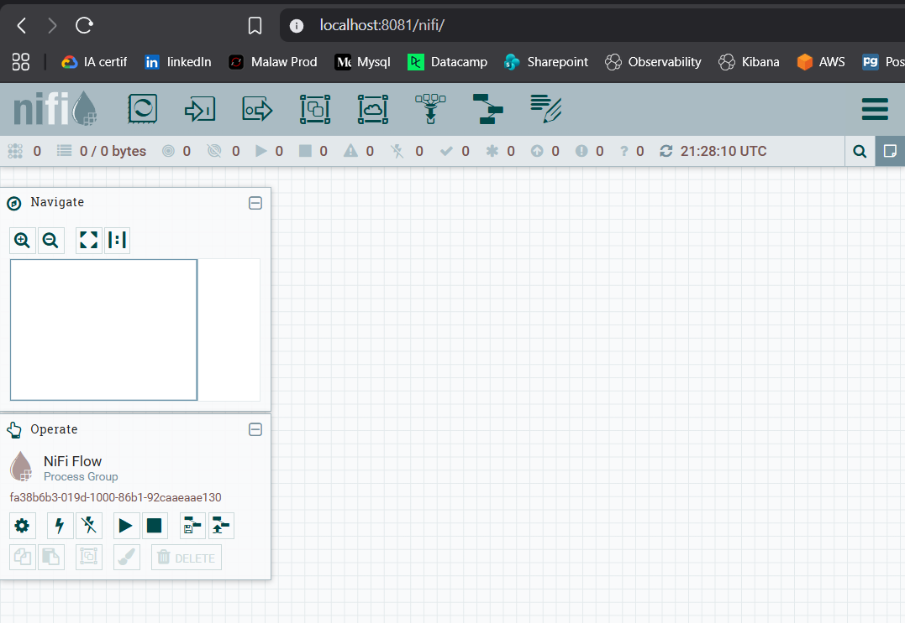

# Agri-Insight SN : Plateforme Big Data & MLOps Prédictive

## Structure du Dépôt

- **`scripts/`** : Moteurs de calcul Spark, schémas Hive et scripts de maintenance.
- **`dags/`** : Orchestration MLOps (Pipeline automatisé sous Airflow).
- **`docker/`** : Infrastructure complète (Docker Compose, Hive Site).
- **`nifi_templates/`** : Templates d'ingestion exportés pour NiFi.
- **`dashboard/`** : Code source et visuels du tableau de bord final.
- **`rapport/`** : Livrables finaux (Mémoire technique en PDF/DOCX).

---

## Guide de Démarrage Rapide

### 1. Lancement de l'infrastructure

```bash
cd docker
docker-compose up -d
```

### 2. Accès aux Interfaces Web

- **NiFi** : [http://localhost:8081](http://localhost:8081)
- **Hadoop** : [http://localhost:9870](http://localhost:9870)
- **Spark** : [http://localhost:8080](http://localhost:8080)
- **Airflow** : [http://localhost:8082](http://localhost:8082) (Login: `admin` / Pass: `CYcnzsqcZgxcUWfX`)

### 3. Exécution du Pipeline

Le pipeline est entièrement automatisé via Airflow. Activez simplement le DAG `agri_insight_mlops` depuis l'interface web pour lancer l'ingestion, le nettoyage et le réentraînement du modèle.

---

## Captures NiFi

L'ingestion NiFi est configurée pour surveiller le dossier `data/bronze` et déplacer automatiquement les fichiers vers le HDFS.



---
